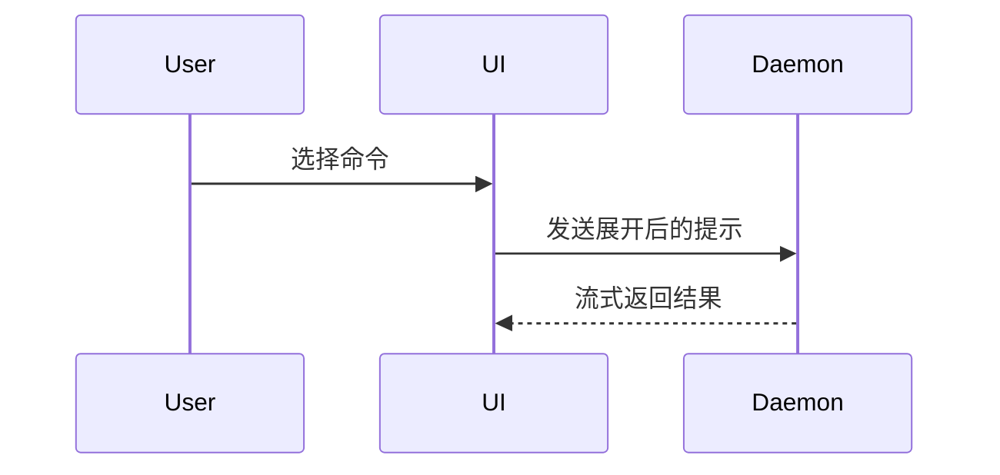

写 PR body 时用这个模板：

```markdown
## Summary（摘要）

<图表、diff 草图，或树>

## Evidence（证据）

- **Before:** <截图 / 输出 / 失败中的测试运行>
  **After:** <截图 / 输出 / 通过了的测试运行>

## Merge Danger（合并风险）

**Door:** <单向门或双向门>

<可选：说明>

**Blast Radius:** <一个词的描述>

<可选：合并的潜在影响>
```

## 各章节

跳过所有开场白，行文保持简短。使用 `CONTEXT.md` 里用户的领域语言。

### Summary（摘要）

挑最小的、能把关键点讲清楚的视图。

- 逻辑或算法用伪代码展示：

```text
on(save)
  if content is unchanged
    return cached result
  write new content
  return fresh result
```

- 运行时控制流用调用树展示：

```text
submitForm
  createSession
    persistPrompt
    launchAgent
  navigateToSession
```

- UI 结构用组件树展示，包含真正重要的状态和模块边界：

```tsx
<SessionPage>(apps / example / src / routes / session.tsx);
useSessionEvents() < SessionToolbar > <RunSkillButton>(packages / ui);
```

- 文件职责或大范围重构用浅文件树展示：

```text
src/
├── commands/       # 解析用户动作
├── sessions/       # 掌管会话状态
└── transport/      # 发送 API 请求
```

- 组件交互、控制流或数据流用 Mermaid 展示：



- 当重点是"变了什么"、而周围形状已经存在时，用 `diff`。让 diff 的形状匹配主题。

组件变更：

```diff
 <SessionPage>
   useSessionEvents()
   <SessionToolbar>
+    <RunSkillButton />
   <SessionTimeline>
+    <SkillResultCard />
```

文件布局变更：

```diff
 src/
 ├── commands/
+│   └── show-me.ts       # 展开 slash 命令
 ├── sessions/
-└── transport.ts
+└── transport/
+    ├── client.ts
+    └── stream.ts
```

调用树或调用栈变更：

```diff
 submitForm
   createSession
     persistPrompt
+    expandSkillMention
     launchAgent
-  navigateToSession
+  navigateToSession
+    subscribeToEvents
```

状态或控制流变更：

```diff
 on(save)
-  write content
+  if content is unchanged
+    return cached result
+  write new content
+  invalidate cache
```

- 当大部分内容都是新的、省略上下文会掩盖归属或顺序、或者用户需要一个可复制的目标形状时，展示完整代码块：

```ts
function expandSkill(command: string): string {
  const skillName = command.slice(1);
  return `use the ${skillName} skill`;
}
```

#### 指引

把每个视图放在它所支撑的短文字旁边。只保留回答用户当前问题、或解决当前讨论点所需选项所必需的调用、文件、props、状态和边界。

这些视图你可能会用一个、用几个，但不太可能全都用上。用你的判断力，别把用户淹没。

### Evidence（证据）

证明变更确实生效的具体证据。展示前后对比。

截图是 S 级，前提是环境已经搭好、且变更本身是视觉性的。

基于执行的证据是 A 级：测试结果、控制台输出。用伪代码展示那个先失败、后通过的具体测试。

### Merge Danger（合并风险）

说明它是单向门还是双向门。双向门可以走回去，单向门不能。回滚代价低的 PR 风险更低。涉及破坏性操作或难以逆转的决策的变更，是单向门。

Blast radius（爆炸半径）是这个 PR 引入变更的潜在影响或波及范围。把所有可能性都考虑一遍。例如：布局偏移、对使用方的破坏、移动端响应性等。
